# School_District_Analysis

## Overview of the School District Analysis
The purpose of this analysis was to re-examine the original data report sent to Maria and her supervisor because the school board notified them of possible academic dishonesty for the reported math and reading scores of ninth graders in one particular school -- Thomas High School. Though the school board has not completely confirmed the extent of the academic dishonesty, Maria requested that all math and reading scores for ninth graders at Thomas High School be replaced with "NaN" ("Not a Number"), while keepiing the rest of the data intact. After the score data for Thomas High School was adjusted as requested, the school district analysis was repeated once more to analyze how those adjustments affected the overall analysis. 

## Results
Using bulleted lists and images of DataFrames as support, address the following questions.
### How is the district summary affected?
Prior to the adjustment, the district summary showed the data as seen below:

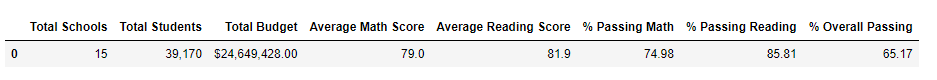

After the adjustment was made, the impact seems miniscule. When factored into the rest of the student dataset, the removal of 461 scores from 9th graders at Thomas High School from the rest of the 39,170 student scores that encompass all grade levels at all other school in the district, the results don't appear to move much. In fact, the change resulted in a less than 1% difference, as the average math/reading scores as well as the % passing math/reading data all still round to the same whole number. Refer to the below image for the adjusted dataset:

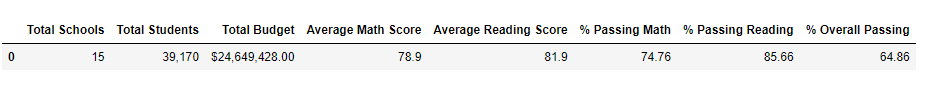

### How is the school summary affected?
When examining how the summary summary was affected for Thomas High School though, the adjustment showed a much larger impact to the data. Before changing the ninth grade scores to null for Thomas High School, the overall passing rate was 65%. Refer below:

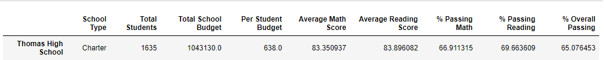

After factoring out the ninth graders' scores at Thomas High School though, the overall passing percentage rate increased to nearly 91%. The passing math and reading percentages also individually increased sharply to 93% and 97%, respectively. In other words, the low scores for thomas High School's 9th graders heavily skewed and impacted the rest of the school's data. See below:

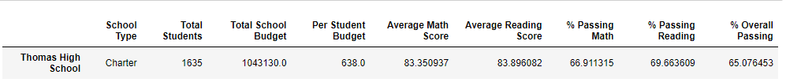

### How does replacing the ninth graders’ math and reading scores affect Thomas High School’s performance relative to the other schools?
In the original dataset prior to discarding the math and reading scores for the 9th graders at Thomas High School, Thomas High School's overall passing percentage of 65% ranked squarely in the middle of the pack amongst the fifteen schools in the district. See below for the original analysis:

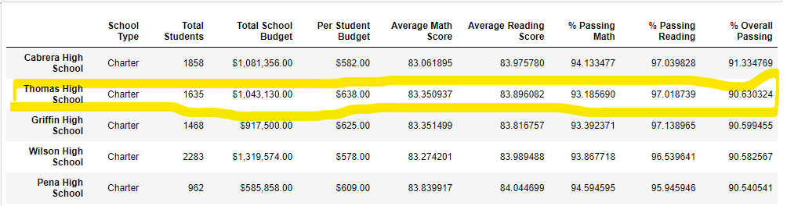

After replacing the scores with only 10th-12th grade scores, with the new overall passing percentage at nearly 91%, Thomas High School jump to the #2 ranking amongst the district. See below:

### How does replacing the ninth-grade scores affect the following:
#### Math and reading scores by grade
Thomas High School originally reported 83.6 for their 9th graders' average math score and 83.7 for their 9th graders' average reading score. Replacing the ninth-grade scores with NaN only affected the school's overall average but did not affect the individual averages for the other grade levels. Only the 9th grade math and reading scores at Thomas High School were changed to NaN. Therefore, all the score averages for other grade levels at all other schools including Thomas High School remained the same.

Math Scores by Grade:

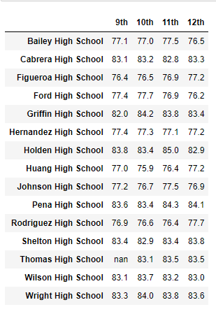

Reading Scores by Grade:

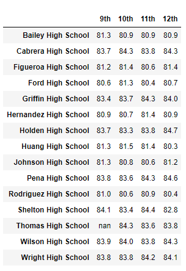

#### Scores by school spending
*** REDO AND CHECK Thomas High School falls into the $630-$644 bin of stundent spending range. There was a slight but noticeable impact to the data. The average math and reading scores still round to the same whole number, but the % Passing Math, % Passing Reading, and % Overall Passing data saw some shifts. Both the math and reading percenages saw an approximately 2% increase, while the overall passing percentage surpisingly saw a 12% decrease. See below:
Original:

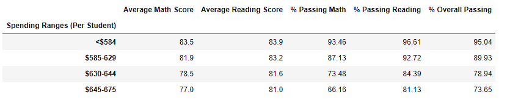

Adjusted:

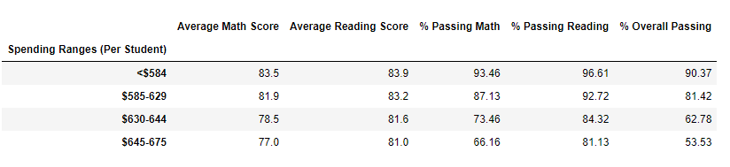

#### Scores by school size
Based on Thomas High School's population, it is considered a medium sized school. There was a slight but barely noticeable increase in the passing percentage data. This change would not be noticeable unless the numbers are formatted to show to the hundreths place. The averages for math and reading remained the same. However, the passing math, reading, and overall passing percentages all saw an extremly slight reduction. See below:
Original:

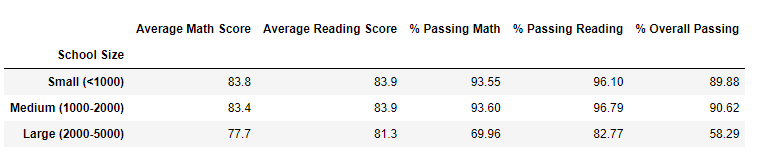

Adjusted:

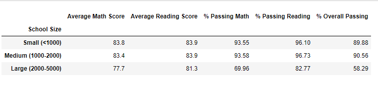

#### Scores by school type
Thomas High School is a charter school. Likewise with school spending and school size, there was a slight but barely noticeable change that could only be discerned after formatting the data to the hundreths place. Once again, the averages for math and reading remained the same. However, the passing math, reading, and overall passing percentages all saw an extremly slight reduction.See below:
Original:

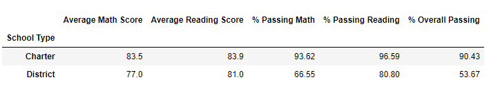

Adjusted:

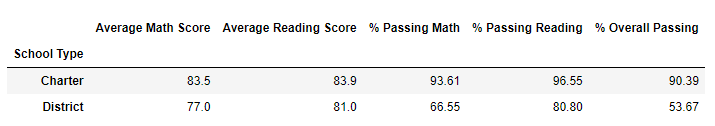

## Summary
In summary, the replacing of NaNs for reading and math scores at Thomas High School had minimal impact on the overall scores and passing percentages when looked at within the district as a whole. However, there was significant impact to the data when comparing Thomas High School's new adjusted data to the rest of the schools' data individually. The changes resulted in a significant increase for Thomas High School's passing math percentage, passing reading percentage, and the overall passing percentage. Additionally, as a result of this increase in overall passing percentage, Thomas High School's new values changed its position amongst the other schools in the district. Most notably, its ranking amongst the rest of the schools increased from its original #8 ranking to the #2 ranking, making it the high school with the second highest overall passing percentage within the district, behind only Cabrera High School.

However, all the other impacts to the data were minor and hardly noticeable. There were slight reductions in the school spending, school size and school type. However this can only be seen when formatting the % Passing Math, % Passing Reading, and % Overall Passing data to the hundreths place. If only whole percentages are used, the changes would not even be noticed except for in the school spending.
